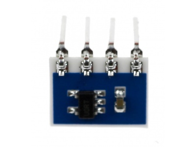

title: Uniroma3 IoT
author:
  name: Francesco Uliana
  twitter: warrior10111
  url: http://www.uliana.it/francesco/
  email: francesco@uliana.it
output: slides.html
controls: false

--

# Java and the IoT
## 26-05-2016


--

### Francesco Uliana

Tecnologo @ CNR

Reti e Sistemi informativi - UF Sistemi Enterprise

- Java Enterprise
- Sistemi distribuiti
- IoT

--

### Il progetto: Weather Station in a box

Requisiti:
- acquisizione temperatura via sensore
- webcam
- informazioni meteo
- fornire accesso mediante interfaccia web
- ~~comunicazione su Twitter~~


--

### Obiettivi

- realizzazione di un'applicazione "real world" Java 8
- interagire con Web APIs
    + ~~Twitter~~
    + OpenWeatherMap
- utilizzare strumenti di versionamento del codice (e.g. git)

--


### Strumenti

- Raspberry Pi
- Java 8 + Spring 4
- Temperature Sensor TC74A
- Webcam UVC


--

### Raspberry Pi

- single-board computer
- sette versioni 5÷35 $
    + un processore ARM
    + 256, 512, 1024M di memoria.
    + SD per boot e memoria non volatile
- supporta sistemi operativi basati sul kernel Linux

<!-- un calcolatore implementato su una sola scheda elettronica -->
<!-- insegnamento di base dell'informatica e della programmazione -->

--

### Raspberry Pi


--

### Temperature sensor TC74A



comunica su **I2C** con address _0x48_.

Funziona tra -40°C e +125°C e può essere alimentato sia a 3V che a 5V.

--

### I2C

**I²C**, abbreviazione di Inter Integrated Circuit (pronuncia i-quadro-ci o i-due-ci), è un sistema di comunicazione seriale bifilare utilizzato tra circuiti integrati.

Standard supportato da Arduino e Raspberry Pi

--

### Web APIs

**application programming interface (API)**

- programmatic interface
- one or more publicly exposed endpoints
- typically expressed in JSON or XML
- HTTP-based.

e.g. Facebook, Twitter

--

<http://api.openweathermap.org/data/2.5/weather?id=3169071&appid=XYZ>

```
{
    "coord": {
        "lon": 12.42,
        "lat": 41.9
    },
    "weather": [{
        "id": 800,
        "main": "Clear",
        "description": "clear sky",
        "icon": "01d"
    }],
    "main": {
        "temp": 292.66,
        "pressure": 1015,
        "humidity": 49
    },
    "wind": {
        "speed": 2.1,
        "deg": 100
    },
    "id": 3169071,
    "name": "Comune di Roma",
    "cod": 200
}
```

--

### Architettura

- Java 8
- Spring
- Spring boot (executable jar)
- Maven
    - `~/uniroma3-iot $  ./mvnw spring-boot:run`

---

### Dipendenze Maven (jar)

```
<dependency>
    <groupId>org.springframework.boot</groupId>
    <artifactId>spring-boot-starter-web</artifactId>
    <version>1.3.5.RELEASE</version>
</dependency>

<dependency>
    <groupId>com.pi4j</groupId>
    <artifactId>pi4j-device</artifactId>
    <version>1.0</version>
</dependency>

<dependency>
    <groupId>com.github.sarxos</groupId>
    <artifactId>webcam-capture</artifactId>
    <version>0.3.10</version>
</dependency>
```

--

### Acquisizione temperatura

```
public static final int ADDRESS = 0x48;
public static final int BUS_NUMBER = I2CBus.BUS_1;

I2CBus bus = I2CFactory.getInstance(BUS_NUMBER);
I2CDevice device = bus.getDevice(ADDRESS);
int value = device.read(0);
```

--


### Acquisizione webcam

```
Webcam webcam = Webcam.getDefault();
webcam.open();
BufferedImage img = webcam.getImage();
webcam.close();
ByteArrayOutputStream bao = new ByteArrayOutputStream();
ImageIO.write(img, "jpg", bao);
// do something with bao
```

--

### Web API

```
@Autowired
private RestTemplate restTemplate;

...

Map<String, String> map = new HashMap();
map.put("id", "3169071");
map.put("appid", "XYZ");

ResponseEntity<Weather> w = restTemplate
    .getForEntity(
        "http://api.openweathermap.org/.../weather?id={id}&appid={appid}",
        Weather.class,
        map);
```

--


### Web Page

```
<!DOCTYPE html>
<html>
  <head>
    <meta charset="utf-8">
    <meta http-equiv="X-UA-Compatible" content="IE=edge">
    <title>IoT demo</title>
    <link rel="stylesheet" href="">
  </head>
  <body>
    <p><b>Temperatura:</b> 99</p>
    <p><b>Meteo:</b> clear sky</p>
    
  </body>
</html>
```

--

### Live coding

putting it all together on _IntelliJ idea_

---

### Spunti di Java 8

- Optional
- Stream

---

<https://github.com/francescou/spring-boot-IoT>

```
git clone git@github.com:francescou/spring-boot-IoT.git

./mvnw spring-boot:run
```
